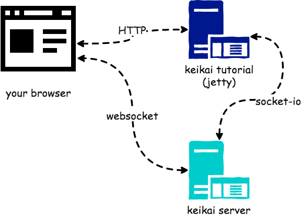

# Keikai Tutorial
[Keikai](https://keikai.io/) is a web spreadsheet component designed for big data. This project demonstrates how you can use Keikai to build an application with its Java client API. 
The tutorial takes two examples: **an Online xlsx File Editor**, and **a Budget Expense Summary App** to explain how you can build your own web application with Keikai.


# Prerequisite
You need to download and start keikai server before running this project.
1. [Contact us](https://keikai.io/#contact) to get **Keikai server** according to your OS system (ex. 64bit Windows)
2. unzip the downloaded zip file, go to `keikai` folder
3. run the executable command:
* Mac/Linux

`./keikai`
* Windows

`keikai.bat`

After executing the command, you should see some messages like:
```
1:8888:2018-06-05 09:52:18.059549Z:keikai_dart_server:keikai_server:0
INFO: Keikai version: 1.0.0-alpha.0@jhsioate
...
INFO: Rikulo Stream Server 1.7.0 starting on 0.0.0.0:8888
...
```

Then Keikai server should start up successfully at `localhost:8888`


# Keikai Server Options
## With different port and address
`./keikai  —port=9999 —address=192.168.1.1`

## Help
For other options, you can check with the command:

`./keikai --help`


# How to Run This Project
You can run this project with a gradle wrapper without installing anything in advance (gradle wrapper will install required files for you). Just run the following command in your command line interface:
* Linux / Mac

`./gradlew appRun`

* Window

`gradlew appRun`

Then visit the following URLs with your browser:

* [http://localhost:8080/tutorial/editor](http://localhost:8080/tutorial/editor) 
* [http://localhost:8080/tutorial/app](http://localhost:8080/tutorial/app) 


## Connect to a Different Keikai Server Address
By default, this project connects to a Keikai server at `localhost:8888`. If you wish to connect to a different address, please append a query string with the `server` key:
 
 `http://localhost:8080/tutorial/editor?server=10.1.1.1:8888`


# Supported Browser
Chrome


# Supported File Format
Microsoft Excel Open XML Document (**.xlsx**) only


# Scenarios to Demonstrate
## Online Excel File Editor
This project demonstrates how you can use Keikai as an online xlsx editor, providing the familiar spreadsheet experiences in the Web such as formula, filtering, sorting, conditional formatting, and so on. To try out the demo, you can upload an Excel file and edit it in a browser. Please visit [http://localhost:8080/tutorial/editor](http://localhost:8080/tutorial/editor) with you browser.

If you fail to import an xlsx file, please kindly send the file to [info@keikai.io](mailto:info@keikai.io).

## Budget Expense Summary App - Working with a Database
This project shows you how you can pre-load an Excel template, and populate data into the template from your database. It also demonstrates how you can save the changes back to the database. 

To try out this App, please visit [http://localhost:8080/tutorial/app](http://localhost:8080/tutorial/app) with you browser. Follow the on-screen instructions and add a new expense to the 2nd page. The application will bring you back to the first page displaying updated numbers and charts. 


* `AppServlet`: Works as a controller, handles HTTP requests. It calls `MyApp` to achieve business function.
* `MyApp`: service layer. Implements application logic with Keikai Java client API. It relies on `SampleDataDao` to communicate (query/save) with the database.
* `SampleDataDao`: persistence layer. Connects to HSQL database with JDBC. This DAO (Data Access Object) class is responsible for query and save expense data into the database. 


This project saves data into [HSQLDB](http://hsqldb.org/). Note that this is just an example, you can definitely load data from any other data source by yourselves. 


# Project Architecture


* When calling Keikai Java client API, it communicates with Keikai server.
* Keikai server communicates with Keikai client in a browser to render a sheet and exchange data.


# Import Larger Files
Importing larger file requires larger heap size. Here are suggested minimal heap size for an application server.

| File size | Number of Cells| Suggested Heap Size| 
| --------- | -------------- | ------------------ |
| 10 MB     | 1.4 millions  | 1.5G  |
| 20 MB     | 2.9 millions  | 1.9G  |
| 40 MB     | 8.7 millions  | 2.5G  |

If you wish to try importing large files, please increase your heap size accordingly. 
You can increase the heap size with JVM arguments:

`gradle appRun -Dorg.gradle.jvmargs=-Xmx4g`
