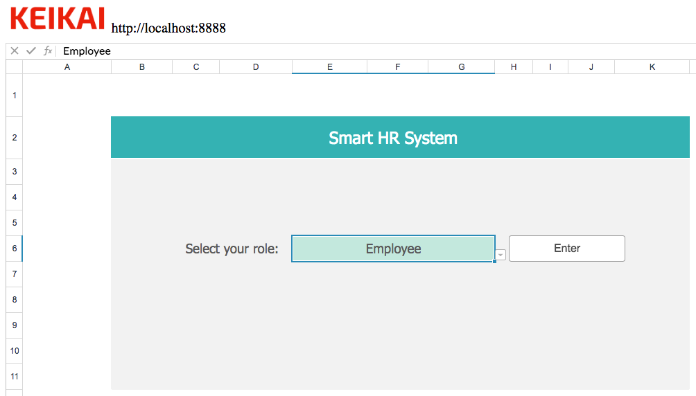
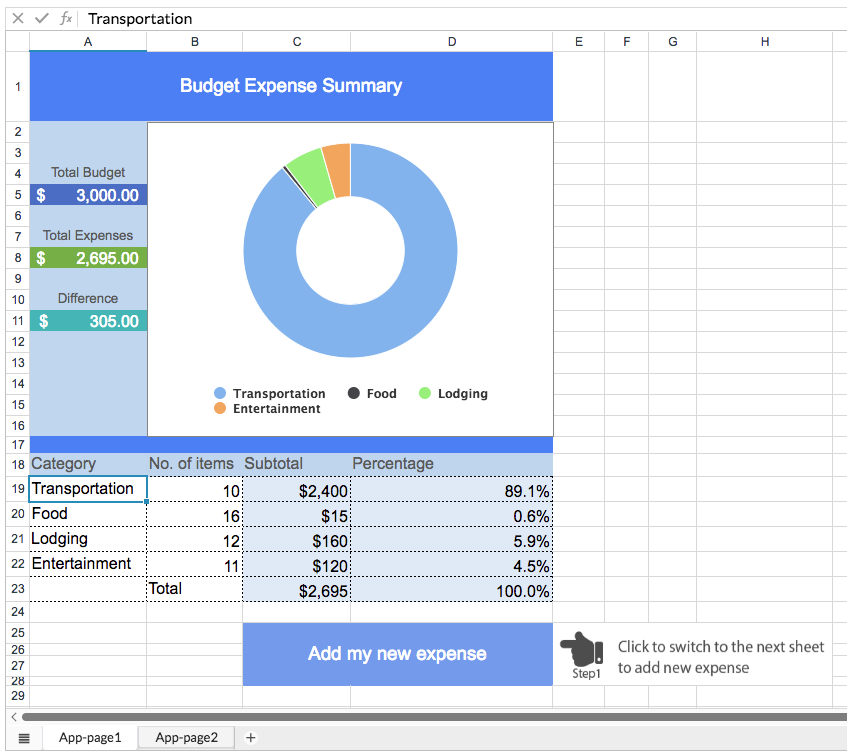
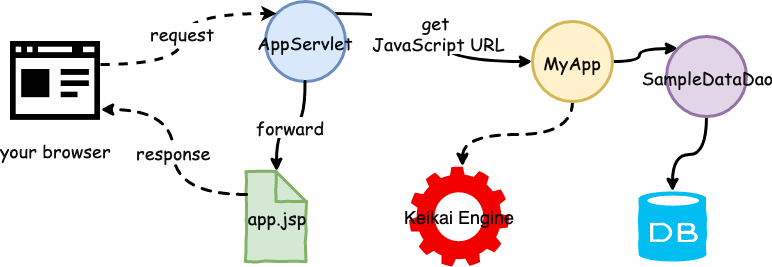
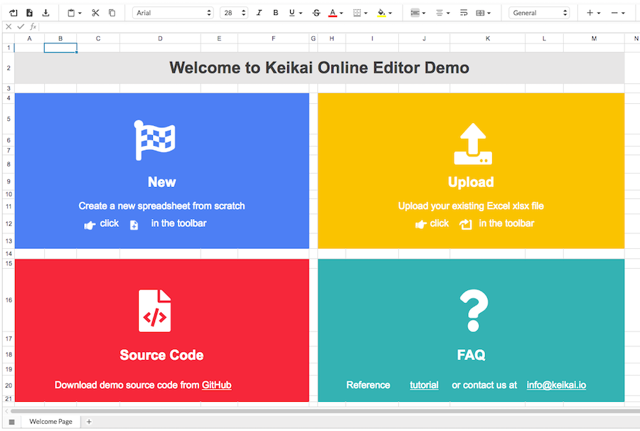
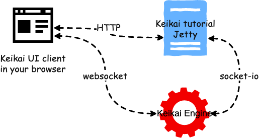

 
# Keikai Tutorial
[Keikai](https://keikai.io/) works as a spreadsheet engine of your web application. This project demonstrates how you can build an application in Keikai's Java client API with several examples.


# How to Try Keikai with Chrome
Just 3 steps:
1. [start Keikai server](#Start-Keikai-Server)
2. [start an application server](#Start-an-application-server)
3. visit [http://localhost:8080](http://localhost:8080) or URLs below with Chrome:
* [http://localhost:8080/tutorial/app](http://localhost:8080/tutorial/app) 
* [http://localhost:8080/tutorial/workflow](http://localhost:8080/tutorial/workflow) 
* [http://localhost:8080/tutorial/editor](http://localhost:8080/tutorial/editor)


# Start Keikai Server
You need to download and start keikai server before running this project. Keikai server is a standalone server that serves you spreadsheet related functions.

## Download Keikai server according to your OS.

* [Windows x64](https://keikai.io/download/?dl=uqX0SgPJhQpSbkwIG5BQoA%3D%3D%3AVmmDd0Rry914lKVQcy2byg%2B8EE3VSlwpUX0XdRvJJG0RT9AoxoPSANsPu0R5eVam)

* [Linux x64](https://keikai.io/download/?dl=fDehV968z2fSDWOZhd6WmA%3D%3D%3AQulbl5QougdmI5XzX5ZiIUs7gNoi%2B3aUu%2FHlIfW0toooiD06pYEDJlq8mgSU4SEA)

* [Mac](https://keikai.io/download/?dl=rf9HhoUPpmO0GKQOg8JR8Q%3D%3D%3A0GIku1%2BEwiW2uBz5b1rAU%2BjypP4WugcLGTm8OJ0hFOJ0dAlWGAZERgSRo33IpHDV)

[Contact us](https://keikai.io/#contact) if you have problems to download.

## Run Keikai Server
We suggest you running Keikai server on the same machine as the tutorial project to reduce communication cost between them.
1. unzip the downloaded zip file, go to its `keikai` folder
2. run the executable command:
* Mac/Linux
`./keikai`

* Windows
`keikai.bat`

After executing the command, you should see some messages like:
```
1:8888:2018-06-05 09:52:18.059549Z:keikai_dart_server:keikai_server:0
INFO: Keikai version: 1.0.0-beta.9@jhsioate
...
INFO: Rikulo Stream Server 1.7.0 starting on 0.0.0.0:8888
...
```

Then Keikai server should start up successfully at `localhost:8888`


# Start an application server
Download or clone this project to your machine.

You can start this project on a built-in application server with Maven wrapper without installing anything in advance (the wrapper will download and install required files for you). Just run the following command in your command line interface:

##  Linux / Mac

### Maven wrapper
`./mvnw jetty:run-forked`


## Window

### Maven wrapper
`mvnw.cmd jetty:run-forked`


# Supported Browser
Chrome


# Supported File Format
Microsoft Excel Open XML Document (**.xlsx**) only


# Scenarios to Demonstrate

## Workflow App - Let Business Team Design Their UI


This example is a workflow application built with Keikai only. Besides, it also demonstrates you that business team can design their UI by themselves.


## Budget Expense Summary App - Working with a Database


This example shows you how you can pre-load an Excel template, and populate data into the template from your database. It also demonstrates how you can save the changes back to the database. 

To try out this App, please visit [http://localhost:8080/tutorial/app](http://localhost:8080/tutorial/app) with your browser. Follow the on-screen instructions and add a new expense to the 2nd page. The application will bring you back to the first page displaying updated numbers and charts. 




* `AppServlet`: Works as a controller, handles HTTP requests. It calls `MyApp` to achieve business function.
* `MyApp`: service layer. Implements application logic with Keikai Java client API. It relies on `SampleDataDao` to communicate (query/save) with the database.
* `SampleDataDao`: persistence layer. Connects to HSQL database with JDBC. This DAO (Data Access Object) class is responsible for query and save expense data into the database. 


## Online XLSX File Editor


This example demonstrates how you can build an online xlsx editor with Keikai, providing the familiar spreadsheet experiences in the Web such as formula, filtering, sorting, conditional formatting, and so on. To try out the demo, you can upload an Excel file and edit it in a browser. Please visit [http://localhost:8080/tutorial/editor](http://localhost:8080/tutorial/editor) with your browser.

If you fail to import an xlsx file, please kindly send the file to [info@keikai.io](mailto:info@keikai.io).


# Project Architecture


* The tutorial application calls Keikai Java client API to communicates with Keikai server.
* Keikai server communicates with Keikai UI client in a browser to render a sheet and exchange data.
* This project saves data into [HSQLDB](http://hsqldb.org/). Note that this is just an example, you can definitely load data from any other data source by yourselves. 

# [FAQ](https://github.com/keikai/keikai-tutorial/wiki/FAQ)
